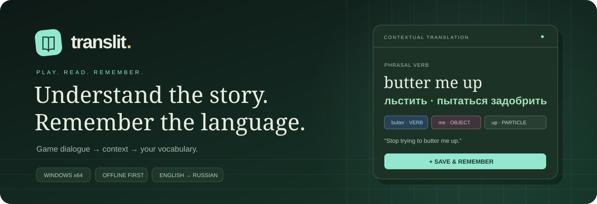
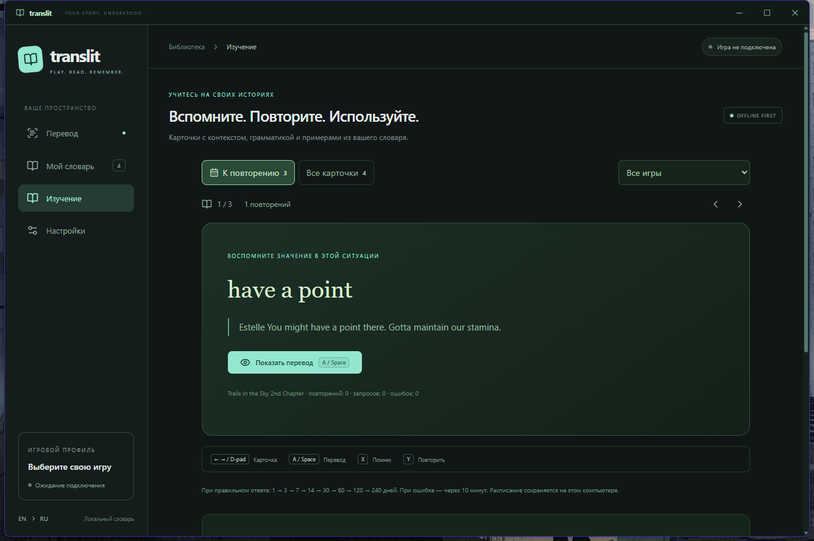

<p align="center"></p>

<p align="center"><b>Переводите игровые диалоги. Понимайте выражения. Учите язык на своих историях.</b></p>

<p align="center">
  
  
  
  
</p>

<p align="center">
  <a href="https://github.com/Nopass0/translit/releases/latest"><b>Скачать релиз</b></a> ·
  <a href="docs/guide.md">Полное руководство</a> ·
  <a href="https://github.com/Nopass0/translit/issues">Сообщить о проблеме</a>
</p>

---

## Из диалога — в личный словарь

**Translit** — приложение для Windows, которое помогает читать одиночные игры на английском и запоминать встреченные слова. Вызовите оверлей, выберите слово или фразу, получите перевод с контекстом и сохраните карточку для повторения.

| Во время игры | После игры |
| :--- | :--- |
| Оверлей по клавише или кнопкам геймпада | Личный словарь с исходными репликами |
| Слова, фразы и смысловые блоки | Ситуация употребления и примеры |
| Перевод реплики и выбранного фрагмента | Интервальное повторение: от 1 до 240 дней |
| V1 / V2 / V3, роли и части речи | Статистика запросов и конструкций |
| Локальные модели CPU / Vulkan GPU | Поиск, редактирование и экспорт JSON |

<p align="center"></p>

## Скачать

**Windows 10 / 11, x64.** Базовый перевод — английский → русский.

| Дистрибутив | Что входит |
| :--- | :--- |
| [**Установщик .exe**](https://github.com/Nopass0/translit/releases/latest/download/Translit-0.3.0-setup.exe) | Приложение, OPUS-MT, грамматическая модель, автономные runtime, OCR и установка WebView2 без загрузки из сети |
| [**Portable .zip**](https://github.com/Nopass0/translit/releases/latest/download/Translit-0.3.0-portable.zip) | Те же модели и runtime; распакуйте архив целиком. WebView2 должен быть установлен |
| [SHA256SUMS](https://github.com/Nopass0/translit/releases/latest/download/SHA256SUMS.txt) | Контрольные суммы пакетов |

Для работы не нужно устанавливать Python, pip, Node.js или инструменты разработчика. Дополнительные модели скачиваются из приложения. Установщик пока без цифровой подписи.

## Первый запуск

1. Установите Translit и запустите игру в оконном режиме или без рамки.
2. Выберите её окно в Translit. Для DX11 x64 используется DLL; для остальных API доступен захват окна.
3. На интересующей реплике нажмите **F8** или **LB + RB**.
4. Выберите слово, смысловой блок или выделите фразу мышью. Поправьте результат, если нужно, и сохраните.
5. Нажмите **Esc / B / F8**, чтобы вернуться в игру. Карточки ждут на странице **«Изучение»**.

Оверлей появляется до распознавания текста. Карточка перемещается за собственный заголовок, ограничивается видимой областью монитора и прокручивает длинное содержимое под ним.

### Управление

| Действие | Клавиатура | Xbox / XInput |
| :--- | :--- | :--- |
| Оверлей / продолжить | F1–F24, буквы, цифры, Numpad, сочетания Ctrl / Alt / Shift | Кнопки, триггеры и сочетания в настройках |
| Выбрать слово / блок в текущем режиме | ← / →, мышь | D-pad / левый стик |
| Предыдущая / следующая фраза | [ / ] | LB / RB |
| Прокрутить карточку | Page Up / Page Down | LT / RT или правый стик |
| Открыть перевод | Enter | A |
| Сохранить | Ctrl + Enter | X |
| Вернуться в игру | Esc / F8 | B |
| Слова / блоки / разбор | Кнопки оверлея | Y |
| Раскрыть учебную карточку | Space / Enter | A |
| Помню / повторить | X / Y | X / Y |

Центральная Xbox / Guide-кнопка недоступна через обычный публичный XInput. Для неё используйте переназначение в выбранную клавишу средствами контроллера.

## Выберите модель под свой компьютер

| Модель | Веса | Устройство | Для чего |
| :--- | ---: | :--- | :--- |
| **OPUS-MT int8 — по умолчанию** | **75 MiB** | CPU | Быстрый перевод реплики на слабом ПК; включена в пакет |
| Bonsai 1.7B Q1_0 | 237 MiB | CPU | Экспериментальный короткий контекст 1024 токена; неполный ответ заменяется OPUS |
| Laya Multilingual ONNX | около 650 MiB | CPU | Выбор словарного значения, речевое действие, буквальный / переносный смысл, тон |
| Qwen3.5 0.8B Q4_0 | 537 MiB | CPU | Экспериментальная компактная модель; слабее в грамматике |
| Qwen3.5 2B Q4_K_M | 1212 MiB | CPU | Контекст и объяснения; экспериментальное качество |
| **Qwen3 4B Instruct 2507 Q4_K_M** | 2382 MiB | CPU / **Vulkan GPU** | Более подробный перевод, объяснения и примеры |
| Ollama / LM Studio | Ваша модель | Ваш сервер | Подключение установленной локальной модели |
| OpenAI / совместимый API | ID провайдера | Облако / сервер | Перевод и анализ через ваш API ключ |

**Настройки → Перевод, контекст и грамматика:** выберите модель, устройство и потоки, затем нажмите **«Установить и использовать»**. Скачивание проверяет SHA-256, повторяет прерванные запросы и продолжает частичный файл при поддержке HTTP Range. Сохранённые параметры применяются при следующем запуске. **«Загружать модель при старте»** включает фоновую подготовку; **«Выгрузить»** освобождает память.

Для GPU выберите **Qwen3 4B → GPU · Vulkan** и установите драйвер с Vulkan. Приложение использует первый доступный адаптер и сообщает об ошибке, если он недоступен. OPUS-MT и экспериментальные Qwen3.5 в этом runtime работают на CPU. Размер файла весов не равен расходу RAM / VRAM.

Автоматический режим CPU оставляет ресурсы игре: половина логических процессоров, максимум восемь. Число потоков можно выбрать вручную.

### Контекст и грамматика

- OPUS-MT переводит текущую реплику целиком и приблизительно связывает выбранные слова с русским текстом. Синтаксис разбирает отдельная встроенная **spaCy en_core_web_sm**.
- Qwen / Ollama / API получают реплику, словарные подсказки и до **12 ранее захваченных реплик**. Приложение не читает сценарий игры непрерывно.
- В оверлее быстрый OPUS-перевод появляется до подробного ответа Qwen / API. Сохранение доступно уже на этом этапе; поздний ответ не перезаписывает введённый вручную перевод.
- Выражения вроде **butter … up**, **have a point**, **look forward to** дополнены авторскими заметками.
- Разбор показывает части речи, подлежащее, объект, формы глагола и известные неправильные глаголы. Смысловые блоки выделяются правилами; фразу можно выбрать вручную.
- OCR, перевод и модельная грамматика могут ошибаться. Перевод и грамматические заметки редактируются перед сохранением.

## Обновление 0.3.0

В настройках появились **русские субтитры поверх игры**: включите режим, задайте область исходного текста, частоту OCR и размер шрифта. Перевод запускается после двух совпадающих распознаваний; поэтому задержка включает OCR, стабилизацию и сам перевод. При смене реплики или потере фокуса устаревший текст очищается. Используйте оконный режим или окно без рамки.

Перенос строки внутри предложения больше не считается самостоятельной фразой. Соседние строки объединяются с учётом расстояния, знаков окончания и меток говорящего. Правила разделяют конструкции и известные идиомы; произвольные границы можно исправить выделением мышью. Карточка перевода стала шире: перевод и текущая реплика слева, разбор и примеры справа, на небольшом экране колонки складываются.

**Laya** по умолчанию скачивается и загружается в фоне после подготовки встроенного runtime. Настройки позволяют отключить автозагрузку, изменить потоки CPU и ограничить контекст 256–1024 токенами. Подсказки сохраняются вместе с учебной карточкой. Laya ранжирует готовые варианты, но может уверенно ошибаться: на проверке различила значения bank, а butter me up классифицировала неверно. Выбор доступен вручную; авторские объяснения идиом имеют приоритет. Laya и Bonsai не используются в быстром цикле субтитров.

**Bonsai** доступна как дополнительный экспериментальный пресет. Короткое окно снижает затраты памяти, но квантование Q1 заметно ограничивает качество. Ответ без поля перевода заменяется переводом OPUS. Для подробных объяснений доступны Qwen и подключённые API.

## Что проверено

В версии 0.2.0 на установленной **Trails in the Sky 2nd Chapter** (`sora_2nd.exe`, ремейк, DX11 x64) проверены захват, оверлей, возобновление и подключение без перезапуска. В одном измерении оверлей стал видимым примерно через **61 мс**, Escape снял паузу через **94 мс**. Это время появления интерфейса, а не готового перевода.

Собственный DX11-стенд проверяет инъекцию, OCR, паузу с обработкой Windows-сообщений, восстановление при выходе приложения, отключение хуков и повторное подключение. Также проверяются CPU-настройки, сохранение учебного расписания и восстановление прерванной загрузки. Детали конкретного релиза — в приложенном `release-validation.json`.

### Границы поддержки

Оверлей — отдельное окно Tauri над захваченным кадром; эксклюзивный fullscreen не гарантируется. DLL поддерживает **DX11 x64**. DX9 / DX12 / Vulkan / x86 доступны через захват окна и требуют проверки на конкретной игре.

В DX11 пауза удерживает цикл на Present и обрабатывает Windows-сообщения. Отдельные потоки симуляции и звук могут продолжаться. Захват окна использует полную приостановку процесса; Windows может считать его не отвечающим. **Detach отключает хуки; DLL остаётся загруженной до выхода игры.**

Физический геймпад, облачный API с пользовательским ключом и установка в отдельной чистой Windows VM пока не проверены.

## Разработка

Требуются Rust MSVC, Node.js, CMake, Visual Studio Build Tools C++ / Windows SDK; Python и 7-Zip нужны только для подготовки автономных ресурсов.

```powershell
npm ci
python scripts/prepare-runtime.py
powershell -NoProfile -ExecutionPolicy Bypass -File scripts/prepare-ocr.ps1
npm run start
```

```powershell
npm run check
cargo fmt --manifest-path src-tauri/Cargo.toml --check
cargo clippy --manifest-path src-tauri/Cargo.toml -- -D warnings
cargo test --manifest-path src-tauri/Cargo.toml
powershell -NoProfile -ExecutionPolicy Bypass -File scripts/smoke-native.ps1
npm run installer
# Запускайте после завершения сборки установщика:
powershell -NoProfile -ExecutionPolicy Bypass -File scripts/package-portable.ps1
```

Интерфейс — `src/`, backend — `src-tauri/src/`, DLL и нативные инструменты — `native/`. Каталоги сборки, модели и временные файлы не публикуются в Git. URL, версии и SHA-256 зависимостей закреплены в манифестах.

## Данные и зависимости

Словарь и настройки хранятся в `%APPDATA%\local.translit.game-dictionary\vocabulary.json`; модели — рядом в `models-v2/`. API ключ — в Windows Credential Manager. Для облачного перевода передаётся текстовый контекст, изображения не отправляются.

Словарь **FreeDict / WikDict** содержит 57 076 статей. Лицензии и исходники сторонних компонентов включены в дистрибутив. Подробные источники: [руководство](docs/guide.md#источники-и-лицензии).
